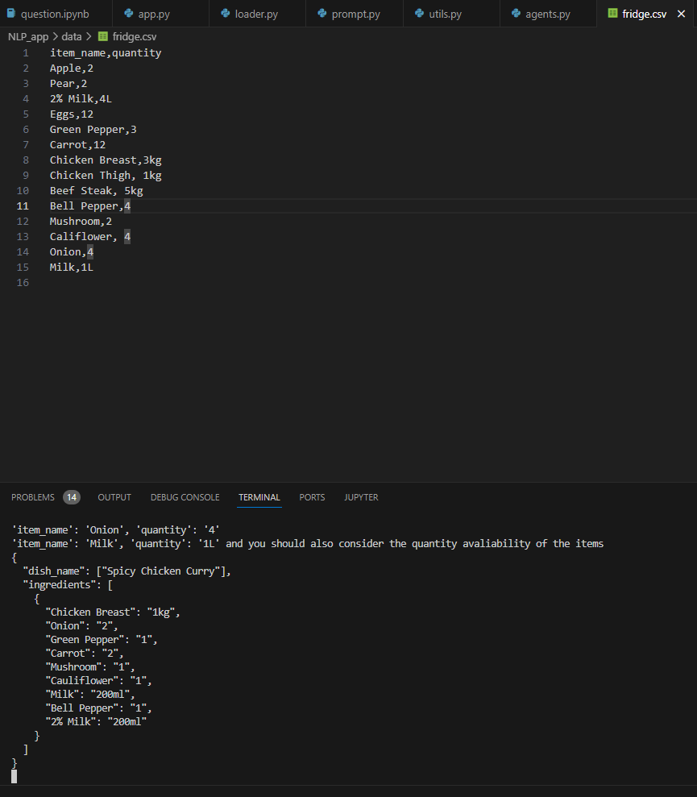

# Chamberlain for your Home    

Introducing Chamberlain, a cutting-edge AI-powered personal assistant that redefines the realm of home automation and assistance. At the heart of Chamberlain lies the integration of advanced Large Language Models (LLMs) like GPT-4, GPT4V and more, and RoBERTa, which bring unparalleled natural language processing capabilities to your home. Chamberlain is designed to understand and respond to a wide array of user needs, from daily schedule management to sophisticated software development tasks. Its intuitive voice control interface makes interaction effortlessly natural, bridging the gap between human and machine communication. Leveraging LangChain technology and multimodal embeddings, Chamberlain provides contextually aware, accurate responses, ensuring a personalized user experience. Whether it's managing your grocery list, planning your entertainments, or assisting with complex coding tasks, Chamberlain is your go-to solution for a smarter, more efficient lifestyle. Join us in embracing the future of AI-powered personal assistance with Chamberlain, where sophistication meets simplicity.

## Features

- **Speech Recognition and Text-to-Speech**: User only need to say what they what, Chamberlain KNOWS.
- **Document Processing and Analysis**: Includes features for handling and processing documents like bills and financial portfolios.
- **Grocery and Fridge Management**: Scans grocery receipts and manages grocery items efficiently.
- **Styling Recommendations**: Provides fashion advice based on user selfie images.
- **Multiple Chat Modes**: Supports various chat modes like Dress, Bill, Finance, Grocery, etc., offering a range of functionalities tailored to each category. User DO Not need to select them and they don't even know what mode they are at, **BUT the Chamberlain KNOWS!**    
    - Eat: Offers personalized meal suggestions, restaurant recommendations, and meal planning based on dietary preferences and nutritional requirements, integrating local restaurant databases and recipe algorithms.  
    - Dress: Utilizes a multimodal model to provide fashion advice, considering current trends, personal style, weather conditions, and occasion appropriateness, and analyzing color schemes, body types, and individual preferences.  
    - Bill: Manages financial obligations by examining incoming bills, presenting the current billing situation, and facilitating timely payments, potentially integrated with budgeting tools.  
    - Finance: Engages a financial chatbot for detailed inquiries, allowing users to upload financial documents and receive personalized advice on investments, portfolios, and overall financial status.  
    - Planner: An advanced organizational tool that manages daily schedules, appointments, and deadlines, integrating with digital calendars and reminder systems for efficient time management.  
    - Grocery: Manages household food supplies by scanning receipts and inventorying fridge contents, suggesting shopping lists based on consumption patterns and dietary preferences.
    - Laundry: Monitors the dirty clothes basket to track laundry needs, suggesting optimal times for laundry and potentially integrating with smart home systems.
    - Fun: Dedicated to leisure and entertainment, offering suggestions for events and activities based on user preferences, location, and availability.
    - IoT: Interfaces with Internet of Things devices to control smart home elements like lighting and temperature, enhancing living space convenience and comfort.
    - Shopping: Tracks purchases and manages receipts, monitors orders from initiation to delivery, and includes price comparisons and product suggestions.
    - Flight: Assists with travel plans by providing information on flight options, ticket bookings, and travel advisories, streamlining the travel planning process.
    - Coding: Offers software development assistance, allowing users to specify software objectives and receiving programmatic solutions.
    - Task: Provides a step-by-step planner for complex tasks, helping users manage and execute heavy tasks efficiently.
    - Other: Handles queries not covered in the above categories, using a Large Language Model to respond to irrelevant or factual questions.

## Installation

To run this application, you need to have Python installed on your system. Please create a virtual environment if you think it is necessary. Follow these steps:

1. Clone the repository:
```bash
   git clone https://github.com/nickShengY/chamberlain_multimodal_multiagent_chatbot.git
```  
2. Install the required dependencies:
Install the Prerequisites:  
- **Tesseract**  
- **Poppler**  
Please visit their Official Webistes for more Info.  
Add the Installation to the System PATH for properly use.  
Then Install required Packages:
```
pip install -r requirements.txt
```  
3. API Key Configurations:  
**Need the Microphone Configuration setup properly**  
**Fill in your API keys for OpenAI and Serp API in api_key.py**  .

## Demos: (Attached the IO Stream Output for better demonstration, the real output should be fully audio)  
I encourage the reader and the developer to experiment more ways of requesting our Chamberlain, there are more functionings left to be explored  
### Normal Chat:   
  
   
  
### Dress Mode:    
  
  Image is from Shein   
  

### Bill Mode and Finance Mode with OCR:  
Too Personal XD  

### Fun Mode:  
  
  
   
**This underlined text is the voice output!**    

### Task Mode:  
  
   
### Flight Mode:  
  
  
   

### Eat Mode:  
This will update the current fridge state as well.   
    
Fridge before cooking:  
  
Fridge after cooking: You may notice the unusal unit and quantity for milk due to the mismatch of the units  
  
Recipe and Instructions (will be audio to the user):   

      
